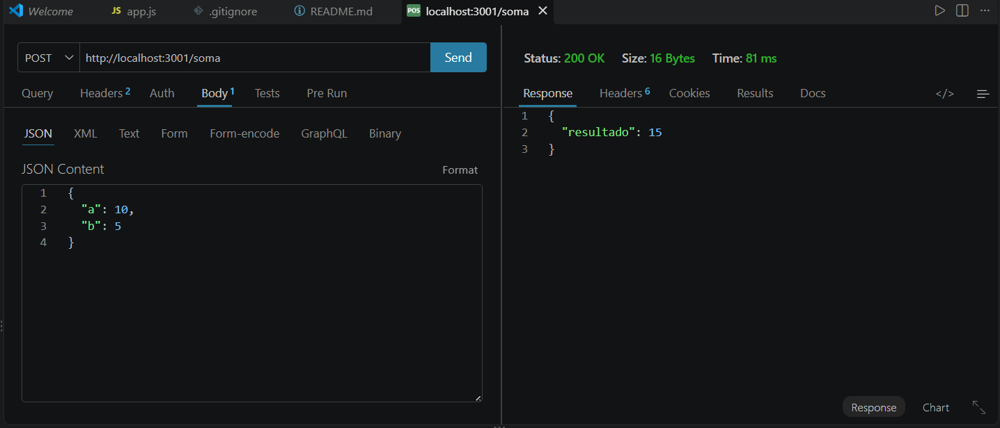
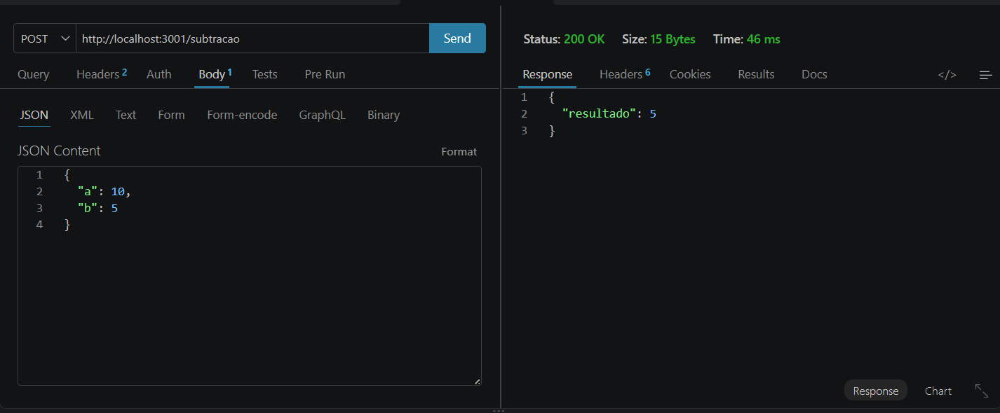
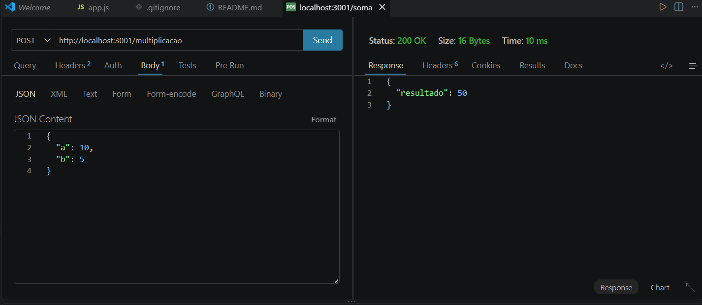
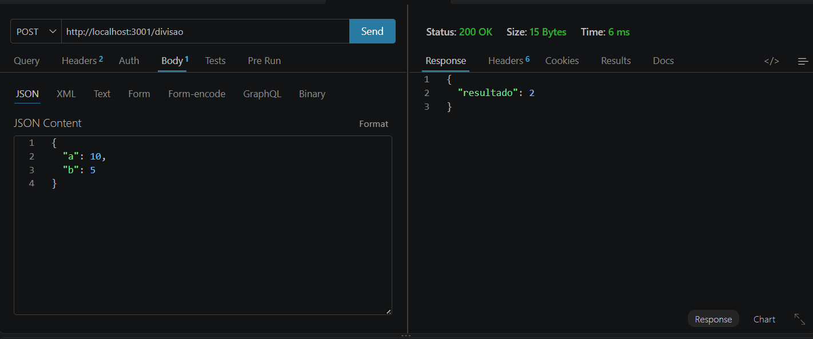

# Entregável 3 — Operações Matemáticas com Express

Aplicação desenvolvida em Node.js utilizando Express para realizar operações matemáticas por meio de requisições HTTP POST.

A aplicação recebe dois números (`a` e `b`) em formato JSON, realiza a operação solicitada e retorna o resultado.

## Tecnologias utilizadas

* Node.js
* Express
* Body-parser
* Thunder Client para testes das requisições POST

## Como executar

É necessário ter o Node.js e o npm instalados.

### 1. Instalar as dependências

Abra o terminal na pasta do projeto e execute:

```bash
npm install
```

### 2. Iniciar o servidor

Execute:

```bash
node app.js
```

O servidor será iniciado na porta 3001:

```text
http://localhost:3001
```

## Como testar

As requisições podem ser testadas utilizando o Thunder Client no VS Code.

Selecione o método **POST**, escolha a rota desejada e, em **Body > JSON**, envie os valores:

```json
{
  "a": 10,
  "b": 5
}
```

### Operações disponíveis

**Soma**

```text
POST http://localhost:3001/soma
```

Resultado:

```json
{
  "resultado": 15
}
```

**Subtração**

```text
POST http://localhost:3001/subtracao
```

Resultado:

```json
{
  "resultado": 5
}
```

**Multiplicação**

```text
POST http://localhost:3001/multiplicacao
```

Resultado:

```json
{
  "resultado": 50
}
```

**Divisão**

```text
POST http://localhost:3001/divisao
```

Resultado:

```json
{
  "resultado": 2
}
```

A aplicação também verifica se os valores enviados são números e impede a divisão por zero.

## Estrutura do projeto

```text
entregavel-3/
├── app.js
├── package.json
├── package-lock.json
└── .gitignore
```

## Imagens do projeto

### Soma


### Subtração


### Multiplicação


### Divisão

